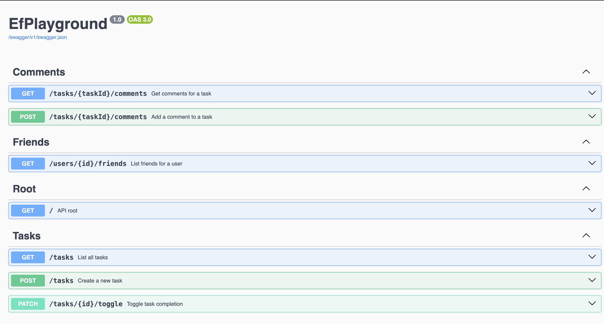
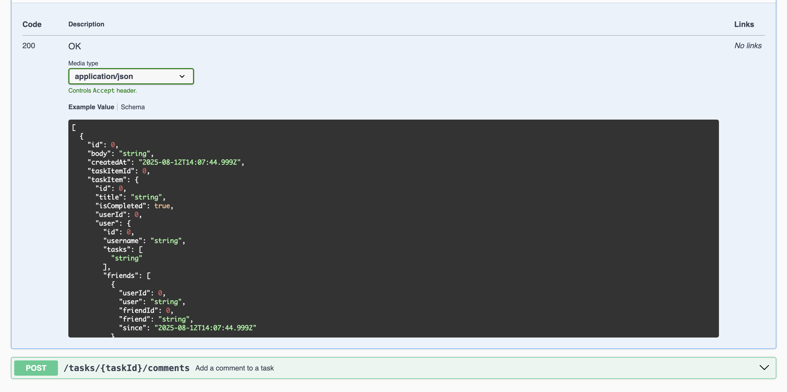

# EF Core Playground

A simple **.NET 9 Web API** project demonstrating **Entity Framework Core 9**, **database relationships**, **data seeding**, and **Swagger UI** integration.  
This project uses **SQLite** for quick setup, with the ability to switch to **SQL Server** later.

---

## 🚀 Features

- **EF Core 9** with `DbContext` and model relationships (`User`, `Task`, `Comment`, `Friendship`)
- **Bogus** library for generating realistic seed data
- **Swagger UI** for testing and documenting endpoints
- Demonstrates:
  - One-to-many relationships (Users → Tasks)
  - Many-to-many relationships (Friendships)
  - Cascading data with comments
- Ready to migrate to SQL Server or other relational databases

---

## 📸 Screenshots

### Swagger UI



### Example Endpoint Output



---

## 🛠️ Setup Instructions

### 1️⃣ Clone the repository

```bash
git clone https://github.com/Mayowa-Dimeji/ef-playground.git
cd EfPlayground
```

### 2️⃣ Install dependencies

Make sure you have the **.NET 8 SDK** installed.  
Then restore the NuGet packages:

```bash
dotnet restore
```

### 3️⃣ Configure the database

This project uses **SQLite** by default.  
Connection string is in `appsettings.json`:

```json
"ConnectionStrings": {
  "Default": "Data Source=app.db"
}
```

### 4️⃣ Run migrations and seed data

```bash
dotnet ef database update
```

Data seeding is done **automatically** at startup via `AppDbSeeder.cs` using **Bogus**.

---

## ▶️ Run the project

```bash
dotnet run
```

You’ll see output similar to:

```
Now listening on: http://localhost:5219
```

---

## 🌐 Using Swagger UI

Open your browser at:

```
http://localhost:5219/swagger
```

From here you can:

- View all endpoints
- Send requests
- See JSON results of seeded data

---

## 📂 Project Structure

```
EfPlayground/
 ├── Data/
 │    ├── AppDb.cs          # EF Core DbContext
 │    └── AppDbSeeder.cs    # Bogus-based data seeding
 ├── Models/
 │    ├── User.cs
 │    ├── Task.cs
 │    ├── Comment.cs
 │    └── Friendship.cs
 ├── Program.cs             # Minimal API + Swagger setup
 ├── appsettings.json       # DB connection string
 └── README.md
```

---

## 📦 Dependencies

- **Microsoft.EntityFrameworkCore** (EF Core ORM)
- **Microsoft.EntityFrameworkCore.Sqlite**
- **Microsoft.EntityFrameworkCore.Tools**
- **Swashbuckle.AspNetCore** (Swagger)
- **Bogus** (Realistic fake data generator)

---

## 📌 Notes

- This project is intended for **learning EF Core relationships and migrations**
- Easily adaptable for SQL Server, PostgreSQL, or MySQL
- Bogus seeds random but realistic data each run

---

## 📜 License

MIT License © 2025 May Dimeji
